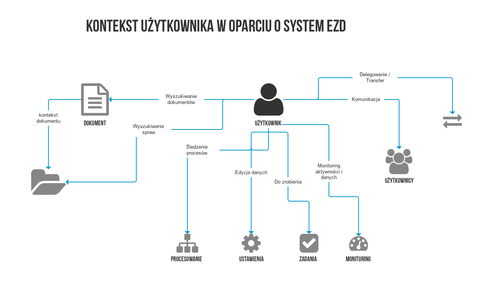

Analiza rozwiązań w zakresie bibliotek komponentów GUI
======================================================

Streszczenie
------------

Cele
~~~~

1. Zbadanie istniejących bibliotek GUI pod kątem technicznym i
   biznesowym.
2. Określenie strategii rozwoju biblioteki GUI.
3. Uszczegółowienie kroków, które zostaną zrealizowane w drugiej fazie
   projektu „projektowania biblioteki GUI”.

Sposób realizacji
~~~~~~~~~~~~~~~~~

Pierwszym etapem projektu była faza badawcza, w trakcie której zostały
opracowane merytoryczne wytyczne do dalszych działań projektowych.
Proces badawczy trwał 3 tygodnie i był realizowany przez zespoły UX oraz
IT.

Analiza była prowadzona równolegle na dwóch poziomach:

1. poziomie technicznym – przeprowadzono analizę istniejących
   frameworków frontendowych uwzględniającą następujące parametry:

   1. Główne zastosowanie frameworku
   2. Kontekst mobilny (łatwość realizowania aplikacji w technologii
      RWD)
   3. Open source (otwarta licencja bez ograniczeń)
   4. Popularność (wśród społeczności programistycznej)
   5. Aktywność społeczności na GitHub
   6. Deklarowana dostępność pod kątem osób niepełnosprawnych
   7. Kompatybilność z przeglądarkami
   8. Zasoby komponentów
   9. Gridy i layouty (sposób organizacji siatki, na której oparty jest
      interfejs graficzny)

2. poziomie funkcjonalnym – opracowano analizę istniejących rozwiązań w
   administracji publicznej:

   1. Wielka Brytania – Gov.uk https://www.gov.uk/service-manual
   2. USA – 18F https://standards.usa.gov/design-principles/
   3. Australia – Digital Transformation DTA
      https://www.dta.gov.au/standard/

Konkluzja
~~~~~~~~~

-  Po przeprowadzeniu analizy 16 frameworków frontendowych ograniczono
   ich wybór do 3 frameworków, które uznano za najbardziej efektywne w
   kontekście strategii użycia w platformie aplikacje.gov.pl: Bootstrap,
   Foundation, Lightning Design System (http://getbootstrap.com/,
   http://foundation.zurb.com/, https://lightningdesignsystem.com)

   -  Kolejnym krokiem będzie przeprowadzenie eksperymentu
      programistycznego. Będzie on polegał na wdrożeniu wybranych
      ekranów makiety aplikacji EZD z użyciem 3 powyższych narzędzi.
      Celem eksperymentu będzie sprawdzenie czasu wdrożenia, wygody
      korzystania oraz jakości zakodowanego produktu.
   -  Efektem eksperymentu będzie decyzja strategiczna o wsparciu
      jednego lub więcej frameworków. Poprzez wsparcie należy rozumieć
      stworzenie nakładek styli, które będą utrzymywane w zgodności z
      aktualną wersją frameworku. Nakładki styli to zbiór reguł
      opisujących wygląd i zachowanie poszczególnych elementów GUI –
      będą obejmowały zarówno dokumentację i wytyczne, jak i kod. Plusem
      takiego rozwiązania jest uwolnienie wykonawcy aplikacji od wyboru
      konkretnego frameworku frontendowego i jednocześnie zachowanie
      spójności interfejsu.

-  Powstała koncepcja Standardów Projektowania (wieloaspektowa wizja
   rozwoju aplikacji dla administracji publicznej.
-  Została wypracowana lista komponentów biblioteki GUI w kontekście
   prac urzędnika w systemie EZD.

Analiza istniejących frameworków frontendowych
----------------------------------------------

Wybrano 16 popularnych frameworków frontendowych (CSS). Frameworki te są
stale rozwijane, mają aktywną społeczność, są open source’owe i
wspierają technologię RWD.

Początkowy wybór frameworków objął:

http://getbootstrap.com/ http://foundation.zurb.com/
https://semantic-ui.com/ https://getmdl.io/ http://materializecss.com/
https://purecss.io/ https://material.angularjs.org/latest/
http://getskeleton.com/ https://ant.design/ https://getuikit.com/
https://milligram.github.io/ http://susy.oddbird.net/
https://material.io/ https://daneden.github.io/Toast/
https://lightningdesignsystem.com https://imperavi.com/kube/

Uzasadnienie wyboru 3 frameworków
~~~~~~~~~~~~~~~~~~~~~~~~~~~~~~~~~

1. **Bootstrap** – najpopularniejszy framework frontendowy na rynku.
   Duża i aktywna społeczność, wiele gotowych rozwiązań, łatwość użycia,
   dynamiczny rozwój i ciągłość projektu.
2. **Foundation** – drugi najpopularniejszy framework. Zalety te same,
   co w wypadku Bootstrap.
3. **Lightning Design System** – framework stworzony przez firmę
   Salesforce na potrzeby aplikacji biznesowych klasy CRM. Mimo niedużej
   popularności frameworku za wyborem przemawia zastosowanie oraz zbiór
   komponentów, dobra dokumentacja i niskie ryzyko zakończenia projektu
   ze strony Salesforce.

Analiza zasad tworzenia standardów projektowych inicjatyw rządowych
-------------------------------------------------------------------

Proces dochodzenia do koncepcji Standardów Projektowych
~~~~~~~~~~~~~~~~~~~~~~~~~~~~~~~~~~~~~~~~~~~~~~~~~~~~~~~

Przeprowadzona analiza strategii Gov.uk obowiązującej w Wielkiej
Brytanii https://www.gov.uk/service-manual, rozwiązania z USA – 18F
https://standards.usa.gov/design-principles/ oraz australijskiego
portalu DTA https://www.dta.gov.au/standard/ ujawniła złożoność
podejścia rządów tych krajów do kwestii tworzenia standardów
projektowania cyfrowych usług rządowych.

Zaangażowanie w transformację cyfrową tych podmiotów przypomina
podejście dużych firm komercyjnych planujących wieloletnie strategie
działania. Należy jednak pamiętać o dodatkowym wymiarze, który jest
specyficzny dla administracji publicznej. Chodzi o transparentność
wszystkich etapów, przeprowadzanie konsultacji społecznych i regularnych
badań z użytkownikami oraz dbanie o czytelną komunikację z nimi.
Opisywane podejście stanowi przykład i inspirację do tego, w jaki sposób
można realizować działania w zakresie optymalizacji procesów
projektowych.

Wyróżniające się cechy analizowanych bibliotek:

-  Przekrojowa baza wiedzy o zasadach tworzenia serwisów rządowych jest:

   -  dynamicznie rozwijana przez interdyscyplinarne zespoły działające
      w oparciu o metodyki zwinne
   -  oparta na badaniach z użytkownikami i wnioskach z analityki ruchu
      w sieci
   -  działająca w trybach ALPHA, BETA, Live
   -  zorientowana na potrzeby użytkowników systemu
   -  komunikująca się z użytkownikami w sposób prosty i konkretny (z
      szacunkiem do czasu ludzi)
   -  pozwalająca na spójne projektowanie serwisów rządowych o różnej
      złożoności

-  Zachęcanie obywateli do komentowania i zgłaszania uwag w możliwie
   konkretny i kontekstowy sposób.
-  Konsultacje ze społecznością poprzez różne kanały (w zależności od
   typu odbiorców)

Inne inicjatywy rządowe w zakresie transformacji cyfrowej:

-  Norwegia – https://www.norge.no/
-  Nowa Zelandia – https://www.govt.nz/
-  Hong Kong – http://www.gov.hk/en/residents/
-  Singapur – https://www.ecitizen.gov.sg/Pages/default.aspx
-  Estonia – https://e-estonia.com/

Efekt analizy - przekrojowe Standardy Projektowania
~~~~~~~~~~~~~~~~~~~~~~~~~~~~~~~~~~~~~~~~~~~~~~~~~~~

Głównym rezultatem analizy jest wniosek, że biblioteka komponentów GUI
to tylko czubek góry lodowej. Dobrze zaprojektowany system wymaga
instrukcji obejmującej większy zakres informacji niż tylko listę
dostępnych klocków. Kompletny zbiór reguł ich używania powinien
obejmować następujące obszary:

Wytyczne dla identyfikacji wizualnej:
^^^^^^^^^^^^^^^^^^^^^^^^^^^^^^^^^^^^^

Część opisująca style dla elementów graficznych GUI

-  Paleta kolorów
-  Posługiwanie się znakiem / znakami
-  Typografia
-  Antywzorce
-  Przykładowe wdrożenia
-  Ikony

Zasady projektowania UI dla interfejsów responsywnych:
^^^^^^^^^^^^^^^^^^^^^^^^^^^^^^^^^^^^^^^^^^^^^^^^^^^^^^

Część opisująca filozofię projektowania na podstawie głównych zagadnień

-  Biblioteka komponentów
-  Layouty
-  Grid
-  Nawigacja
-  Motion
-  Mikrointerakcje
-  Dostępność
-  Walidacja
-  Pomoc i dodatkowa wiedza
-  Notyfikowanie
-  Przykładowe wdrożenia

Komunikacja z użytkownikami:
^^^^^^^^^^^^^^^^^^^^^^^^^^^^

Część opisująca sposoby, styl i ton komunikacji pomiędzy systemem a
użytkownikami

-  Jak tworzyć komunikaty do użytkowników
-  Jakiego języka używać, a jakiego nie używać.
-  Jakie formy komunikacji można stosować (mailing, dokumenty …)

Zasady kodowania:
^^^^^^^^^^^^^^^^^

Część opisująca stosowanie nakładek i reguły tworzenia nowych

-  Dobre praktyki pisania kodu
-  Dobre praktyki organizowania projektu od strony DEV
-  Zasady publikowania na Github
-  Informacje o licencji

Korzyści i ryzyka wynikające z wdrożenia przekrojowych Standardów Projektowych
~~~~~~~~~~~~~~~~~~~~~~~~~~~~~~~~~~~~~~~~~~~~~~~~~~~~~~~~~~~~~~~~~~~~~~~~~~~~~~

Korzyści:
^^^^^^^^^

-  Dysponując powyższym zbiorem wykonawca będzie miał kompletny zbiór
   instrukcji odpowiadający na większość pytań dotyczących
   charakterystyki realizowanej aplikacji.
-  Wdrożenie może być jeszcze tańsze, gdyż część pracy po stronie
   wykonawcy będzie zawarta w opisie standardów.
-  Aplikacje w marketplace będą miały spójny charakter, wygląd i
   nawigację, co skróci czas uczenia się nowych aplikacji.
-  Łączenie aplikacji między sobą będzie prostsze i bardziej
   przewidywalne.
-  Standardy mogą zostać powielone na systemy frontowe, czyli wszystkie
   te, które będą dostępne dla obywateli (na wzór gov.uk i innych), co
   stanowiłoby duży krok w kierunku przemyślanej transformacji cyfrowej.

Niebezpieczeństwo przyjęcia powyższej strategii:
^^^^^^^^^^^^^^^^^^^^^^^^^^^^^^^^^^^^^^^^^^^^^^^^

-  Wieloetapowość takiego przedsięwzięcia wymaga długodystansowej
   strategii. Przerwanie na którymś z etapów przyniesie rezultaty
   odwrotne do zamierzonych (chaos).
-  Brak uwzględnienia koncepcji Standardów Projektowania w tzw. szerszym
   obrazku zwiększy szanse na niepowodzenie projektu.

Założenia wyjściowe dla biblioteki komponentów GUI
--------------------------------------------------

Po opracowaniu wymagań technologicznych, które musi spełniać framework i
analizie istniejących na rynku rządowych przykładów Standardów
Projektowania określiliśmy cechy, które musi spełniać biblioteka
komponentów GUI platformy aplikacje.gov.pl

-  **Uniwersalna** – znajdująca zastosowanie w różnego typu aplikacjach
   back office
-  **Prosta** – o niskim progu wejścia – potencjalnie łatwa we wdrożeniu
   i zrozumiała dla wykonawców
-  **Popularna** – oparta na znanych i rozwijanych rozwiązaniach
-  **Elastyczna** – dająca się łatwo rozbudowywać o nowe technologie i
   komponenty
-  **Otwarta (Open Source)** – dostępna dla wszystkich, którzy chcą
   wykorzystać kod i filozofię projektową
-  **Bezpieczna** – będąca odpowiednio zabezpieczona przed różnego
   rodzaju hakami
-  **Dostępna** – dla osób z różnymi aspektami niepełnosprawności
-  **Dostosowana** – zawierająca komponenty charakterystyczne dla zadań
   administracji publicznej
-  **Responsywna** – zaprojektowana w duchu mobile first uwzględniając
   różne klasy urządzeń.
-  **Wzorcowa** – określająca standardy tworzenia aplikacji rządowych.

**Kontekst użytkownika systemów back office**

Podjęliśmy próbę przeanalizowania przyszłych aplikacji oferowanych w
marketplace. Celem analizy było określenie kontekstu, w którym pracują
użytkownicy. Wyjście od scenariuszy do funkcjonalności pozwala przyjąć
podstawowy zbiór komponentów GUI

**Lista komponentów wynikająca z analizy kontekstu użytkownika:**

-  Lista pracowników
-  Lista dokumentów / spraw
-  Lista wiadomości
-  Lista zadań
-  Struktura organizacji
-  Statusy
-  Ścieżka dokumentu / sprawy etc.
-  Wizytówka pracownika
-  Wizytówka instytucji
-  Moduł prezentujący dane statystyczne
-  Szybkie akcje
-  Moduł powiązanych
-  Moduł udostępniania dokumentu
-  Powiadomienia

   -  system-to-user
   -  user-to-user

-  Panel wyszukiwania
-  Strumień komentarzy
-  Strumień aktywności
-  Strumień powiadomień
-  Znaczniki ładowania plików (loadery)
-  Widgety
-  Formy tekstowe
-  Stopka
-  Zestawy przycisków
-  Tabele
-  Formularze
-  Okno modalne
-  Panel filtrowania treści

**Kolejne kroki w projekcie biblioteka GUI**

-  Opracowanie listy komponentów GUI v1 na podstawie projektowanych
   interfejsów w ramach Platformy.
-  Opracowanie listy wybranych wytycznych projektowych dla przyszłych
   dostawców usług w sklepie (slajd „Zakres Biblioteki GUI”).
-  Opisanie efektów eksperymentu programistycznego polegającego na
   odtworzeniu wybranego widoku w trzech różnych gotowych frameworkach.
-  Podjęcie decyzji odnośnie stworzenia „nakładek” dla wybranych
   frameworków.
